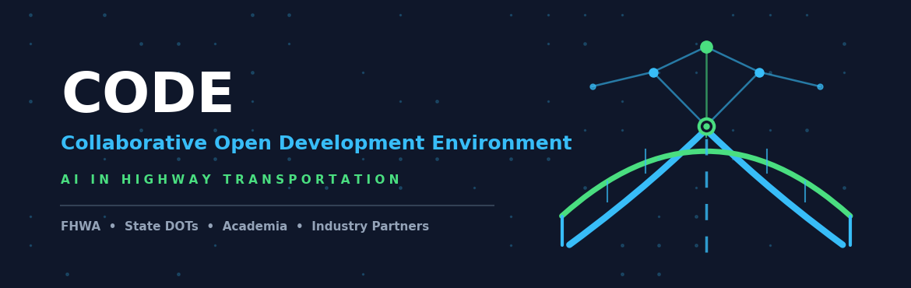

  

# Welcome to the Collaborative Open Development Environment (CODE) GitHub Community

A collaborative space for advancing the responsible and practical use of AI in highway transportation.

The CODE brings together FHWA, State and local transportation agencies, researchers, academia, industry, and other transportation stakeholders to share knowledge, tools, code, data, and lessons learned. Our goal is to move AI research and innovation from individual projects into reusable, practical solutions that can benefit the broader transportation community.

Please see the <a href="https://tfhrc-ai-code.github.io/AI-CODE/" target="_blank" rel="noopener noreferrer">user guide</a>.

Learn more about [FHWA's AI Deployment Center of Excellence (COE)](https://highways.dot.gov/ai-coe)

---

## Our Goal

The transportation community is developing innovative AI applications for areas such as infrastructure inspection/condition assessment, asset management, construction, safety, traffic operations, data analysis, and decision support. However, valuable resources such as code, datasets, models, and lessons learned are often developed independently and can be difficult for others to find, access, reuse, or adapt.

The CODE aims to help address this gap by providing a shared, open, and collaborative environment where transportation stakeholders can:

* **Share** AI code, tools, models, datasets, and resources.
* **Collaborate** on research, development, and implementation challenges.
* **Reuse and adapt** existing work rather than starting from scratch.
* **Learn** from each other's successes and lessons learned.
* **Develop** common approaches, standards, and best practices for AI in transportation.
* **Accelerate** the transition of promising AI research into practical transportation applications.

---

## This Is a Community, Not Just a Repository

The value of this GitHub space depends on participation from the transportation community. We encourage researchers, State DOTs, universities, technology developers, practitioners, and other stakeholders to contribute projects, code, documentation, datasets, examples, and ideas.

Whether you have a fully developed AI tool or an early-stage research prototype, your work can help others, and others can help make your work better.

### We Welcome Contributions Ranging From:
* AI Models
* Source Code
* Datasets
* Algorithms
* Tools
* Applications
* Examples
* Documentation
* Research Prototypes
* Best Practices

---

## License

Unless otherwise noted, code and documentation created by U.S. Federal Government employees in this repository are in the public domain within the United States under 17 U.S.C. § 105.

All community contributions submitted to this repository are released under the [CC0 1.0 Universal (CC0 1.0) Public Domain Dedication](https://creativecommons.org/publicdomain/zero/1.0/) (or [MIT License](https://opensource.org/licenses/MIT)), ensuring that shared tools, code, and datasets remain freely open, reusable, and accessible to all transportation stakeholders.

For more information, please see the [`LICENSE`](./LICENSE) file in this repository.

## Let's Build Together

Our vision is to create a growing community where transportation professionals can find, share, adapt, and improve AI solutions for real-world highway challenges.

> **Have a project to share? Have a problem you're trying to solve? Have code or data that others could benefit from?**  
> Join us, contribute, and collaborate.

**Share what you have. Build on what others have created. Together, accelerate AI innovation for transportation.**
